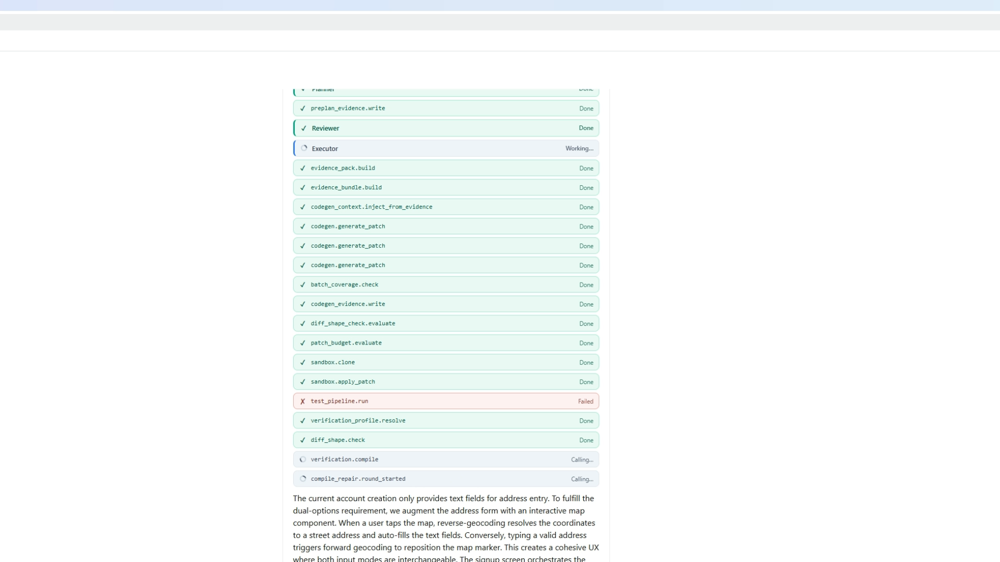

# Ops Agent Platform

[](https://github.com/Viggo-tou/ops-agent-platform/actions/workflows/backend-tests.yml)
[](https://www.python.org/)
[](LICENSE)

A human-in-the-loop LLM coding agent platform with a structural verification harness for software engineering tasks.



▶️ **[Watch the 3-minute demo on LinkedIn](https://www.linkedin.com/posts/viggo-tao-24732740a_tired-of-llm-agents-renaming-a-variable-and-ugcPost-7459855795464155137-XvaE)** — a real Jira ticket walks through plan, codegen, gates, approval, and a before / after of the Android app.

## Problem

LLM coding agents often claim a feature is complete when the patch only implements a small part of the requirement. They satisfy literal signals (one regex match, one keyword) while missing the actual user-visible behavior.

Example: a model was asked to add map-based address selection to a KYC form. It changed geocoder initialization and persisted latitude / longitude — but missed the actual map UI the user needs to pick a location.

## What this project does

Ops Agent Platform takes plain-English work descriptions (e.g. `finish Jira P69-19`), pulls the ticket via MCP, and runs a single-runtime orchestrator through **plan → codegen → verification gates → human approval**.

It is harness-first: the LLM is treated as an untrusted collaborator. Every stage is gated, every claim is verified against the actual artifact, and nothing ships without explicit human approval.

It detects:

- superficial patches passing as full features
- `NO_CHANGE_NEEDED` over-claims
- planner / codegen conflicts
- compile errors that survive the model's self-check
- library API hallucinations (calling methods that don't exist on the library version the project actually ships)
- protected-symbol loss during repair rounds
- weak or trivially-true acceptance tests

## Example: planner-emitted structural acceptance tests

The planner doesn't just produce a free-text plan — it commits to **structural acceptance tests** the reviewer will check against the diff before the patch can ship. A real planner output for an Android map-picker task looks like:

```json
{
  "objective": "Add map-based address selection to KYC signup",
  "must_touch_files": [
    "app/.../CustomerKYCAddressForm.kt",
    "app/.../HandymanKYCAddressForm.kt"
  ],
  "acceptance_tests": [
    { "kind": "diff_contains_pattern",
      "pattern": "MapEventsOverlay|MapEventsReceiver|singleTapConfirmedHelper" },
    { "kind": "diff_contains_pattern_in_file",
      "file": "CustomerKYCAddressForm.kt",
      "pattern": "AndroidView\\s*\\(" },
    { "kind": "import_added",
      "pattern": "org.osmdroid.views.MapView" },
    { "kind": "forbids_pattern_in_diff",
      "pattern": "com.google.android.gms.maps" }
  ]
}
```

`acceptance_check.evaluate` runs each rule against the actual diff. Token matching is not enough — the model has to write the structural change, not just mention it.

## Contract Coverage (v16.2.1)

On top of the planner's acceptance tests, every domain playbook declares **required contracts** — named semantic gates the patch must close before it ships. The model emits a `## CONTRACT_COVERAGE` JSON block on every batch declaring which contracts it implemented, which were already present, and which it deliberately skipped:

```json
{
  "implemented_contracts": [
    {
      "id": "persisted_to_storage",
      "file": "CustomerSignup.kt",
      "evidence_mode": "diff_modified_payload_existing_sink",
      "diff_evidence": "changed payload bindings from 0.0 to selected state vars",
      "context_evidence": "userRef.setValue(userData) in same function consumes the modified map"
    }
  ],
  "verified_no_change_contracts": [],
  "unimplemented_contracts": []
}
```

The harness then verifies every claim against the actual artifact via composite rules (`any_of` / `all_of` / `final_context_contains_pattern`). The verifier is **diff-anchored** — it parses unified diff hunks, resolves the enclosing function scope in the patched tree via brace counting, and matches verification patterns against that scope. This catches the failure class where the model implements a contract by changing the *input* of an existing unchanged sink call (e.g. lat/lng bound to state variables, but the existing `setValue(userData)` line untouched), which a diff-only verifier would misclassify as a lie.

Verdicts are tri-state: `unverified` (verifier blind spot, soft-fail to human review), `contradicted` (patched tree directly disproves the claim, hard-fail), `lie` (extreme — claimed feature has no evidence anywhere, hard-fail).

Live-verified on the Android KYC target: 6 out of 6 required contracts pass after the fix that round 6 incorrectly classified `persisted_to_storage` as a coverage lie.

## Architecture

```
Plain-English request
   ↓
[Intake]      semantic translation + Jira fetch via MCP
   ↓
[Planner]     picks must-touch files, must-inspect files, acceptance tests
   ↓
[Codegen]     per-file batches, parallel; Aider search/replace + unified diff
   ↓
[Harness]     patch budget · feature presence · acceptance check · compile gate · semantic review
   ↓
[Approval]    human reviewer sees plan + diff + verdicts in one place
   ↓
Patch ships
```

See [`docs/ARCHITECTURE.md`](docs/ARCHITECTURE.md) for the full design walkthrough and [`docs/DEMO.md`](docs/DEMO.md) for a guided tour.

### Hallucination defense (the "4 legs")

When a model writes code that calls into a library, four hooks catch the common failure modes before the patch reaches a human:

1. **Repo library fingerprint** in the codegen system prompt — the model knows which library *the project actually depends on*, not just which library is famous.
2. **Post-codegen symbol verifier** — flags references to symbols that don't exist on the resolved version (catches receiver-class hallucinations).
3. **Receiver class body** pulled into repair prompts when an unresolved reference is reported, so the repair model can see the real surface area.
4. **Intent-drop feedback retry** — if a repair round silently drops the intent (file shrinks below the line-ratio gate or a protected symbol disappears), the model is told what was dropped and asked to retry, instead of the silent skip the original implementation did.

These four legs together turned hallucination-prone codegen into reliably-real patches on the Android demo target.

## Tech stack

- **Backend**: Python 3.12, FastAPI, SQLAlchemy 2 (~82k LoC, 130+ pytest cases)
- **Database**: PostgreSQL 16 (SQLite supported as a fallback for quick local hacks)
- **Infra**: Docker + docker-compose for local dev; `docker compose up` brings up postgres + backend together
- **Frontend**: React 18 + Vite + TypeScript — chat UI, plan / diff / approval views, SSE event feed
- **LLM providers**: OpenAI · Anthropic · DeepSeek · MiniMax (pluggable, per-stage provider override)
- **Tooling**: MCP (Model Context Protocol) for Jira / memory / Playwright
- **Domain knowledge**: codegen playbooks (Python, diff discipline, repo-question, task-iteration)
- **Verification**: structural rule evaluator, AST-light truncation, compile gate (Kotlin / Gradle, Python)
- **Benchmarks**: SWE-bench-Lite harness integrated for regression measurement
- **Tests**: pytest, 50+ regression cases for the harness alone

## Running locally

### Docker (recommended)

```bash
# Starts postgres + backend together
docker compose up --build
# → backend at http://127.0.0.1:8000/docs
# → postgres at localhost:5433 (host) / postgres:5432 (internal)
```

The frontend is started separately (it talks to the backend on `8000`):

```bash
cd apps/web
npm install
npm run dev
# → http://127.0.0.1:5173
```

### Without Docker (Windows / PowerShell)

```powershell
# Backend (FastAPI) — uses SQLite by default; set DATABASE_URL for Postgres
powershell -ExecutionPolicy Bypass -File .\scripts\start-backend.ps1
# → http://127.0.0.1:8000/docs

# Frontend (Vite dev server) — in a second shell
powershell -ExecutionPolicy Bypass -File .\scripts\start-web.ps1 -Dev
# → http://127.0.0.1:5173
```

### Environment

Copy `apps/backend/.env.example` to `apps/backend/.env` and fill in the LLM provider keys you want to enable. The platform falls back to mock providers when keys are missing, so the API surface (`/docs`) is browsable without any keys.

## Key result

**Before**: the model could ship a small patch while claiming the whole feature was complete. The reviewer would see a passing `compile_gate` and a coherent diff and rubber-stamp it.

**After**: every planner-declared acceptance test must pass against the diff, the model's library calls must resolve against the actual project dependencies, and protected symbols must survive every repair round.

## Failure taxonomy

The harness ships with a documented failure taxonomy covering recurring LLM failure modes:

| Class | What it catches |
|-------|-----------------|
| C1 | phantom files (claimed but absent in the diff) |
| C2 | polish passing as feature |
| C4 | library API hallucination |
| C5 | malformed new-file patches |
| C7 | compile errors / unresolved references |
| C9 | payload field loss (drops pre-existing fields) |

Each class has a corresponding gate that fails closed, so a gate crash never silently allows the change through.

## Status

MVP / active development. Open to feedback and recruiter conversations.

## License

MIT — see [`LICENSE`](LICENSE).
